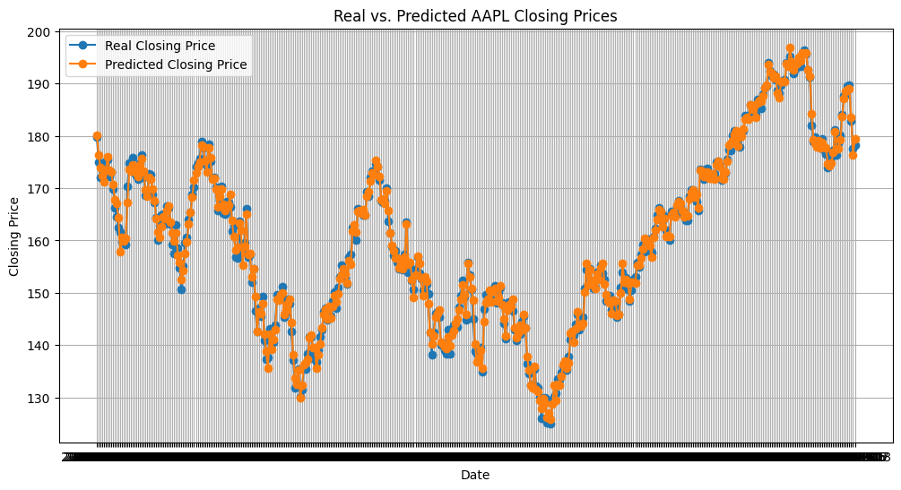

# 📈 Stock Price Prediction of GAAMN using Big Data and PySpark

<table>
  <tr>
  <td>    </td> 
  <td>    </td>   
  </tr>
</table>

This project predicts the stock prices of five major technology companies—**Google, Apple, Amazon, Microsoft, and Netflix (GAAMN)**—using classical machine learning algorithms implemented with **PySpark** in **Google Colab**. It demonstrates an end-to-end big data pipeline, from historical data ingestion to real-time streaming prediction and deployment.

---

## 📊 Project Overview

- **Goal:** Predict the daily **closing price** of GAAMN stocks based on historical data using `Open`, `High`, and `Low` prices as features.
- **Approach:** Implement and compare four regression models:
  - Linear Regression
  - Random Forest Regressor
  - Gradient Boosted Trees
  - Decision Tree Regressor
- **Big Data Stack:** PySpark on Google Colab for distributed data processing and model training.

---

## 📁 Dataset

- **Source:** [Yahoo Finance via `yfinance`](https://pypi.org/project/yfinance/)
- **Date Range:** `2005-01-03` to `2023-09-14`
- **Stocks Covered:** AAPL, GOOGL, AMZN, MSFT, NFLX
- **Features Used:**
  - `Open`: Opening price
  - `High`: Highest trading price of the day
  - `Low`: Lowest trading price of the day
  - `Close` (Target): Closing price

### 📊 Real Vs Predicated Apple Closing Price Visualization



---

## 🧪 Experimental Setup

- **Environment:** Google Colab (freemium)
- **Libraries:** PySpark, yfinance, Pandas, Numpy, Matplotlib
- **Data Split:** 
  - Train: 90% (`2005-01-03` to `2022-01-01`)
  - Test: 10% (`2022-01-02` to `2023-09-14`)

---

## 🏗️ Pipeline Stages

1. **Data Loading & Transformation**
2. **Feature Engineering**
3. **Feature Scaling (StandardScaler)**
4. **Model Training**
5. **Streaming Prediction (Spark Structured Streaming)**

---

## 📈 Model Evaluation (RMSE)

| Model                  | AAPL   | GOOGL  | MSFT   | AMZN   | NFLX   |
|------------------------|--------|--------|--------|--------|--------|
| Linear Regression      | 1.0423 | 0.8844 | 1.9542 | 1.0999 | 3.6550 |
| Random Forest Regressor| 18.0125| 9.3407 | 19.8345| 11.1569| 19.3837|
| Gradient Boosted Trees | 18.2416|10.1972 | 22.8555| 11.1238| 22.5730|
| Decision Tree Regressor| 17.8953|10.0826 | 22.8870| 11.1944| 22.9149|

✅ **Linear Regression outperformed all other models across all stocks.**

---

## 🔁 Real-time Deployment

- **Chosen Model:** Linear Regression
- **Streaming Framework:** Spark Structured Streaming
- **Checkpointing:** Enabled via Google Drive
- **Output Format:** CSV (Date, Close, Prediction)

### 🌀 Example Stream Output

```csv
Date,Close,Prediction
2023-09-01,186.57,185.91
2023-09-02,185.80,185.45
...
